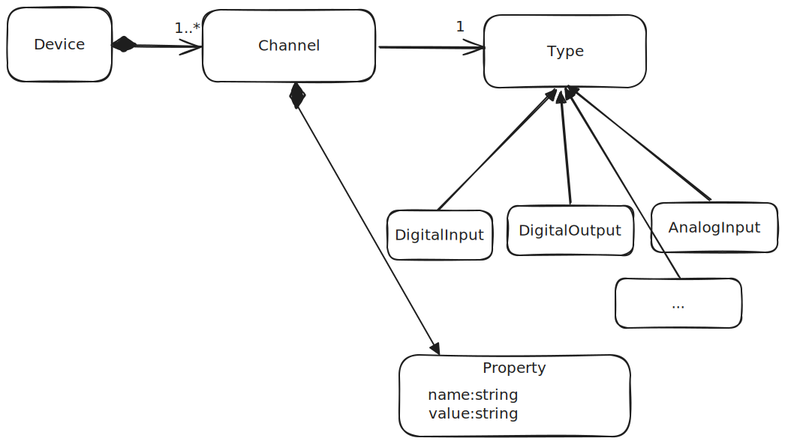

# Channel Configurator
**❗Important❗**: The code in this repository is not applicable for production. It acts as an example for implementing various technical concepts like Multi-User support, Pagination, CI... needed in an "modern" Angular based web application, as well as for providing such an application using modern built tools

This repo can be used as an example for setting up large scale angular application.

## Repository Setup

This repo is a monorepo built using [NX](https://nx.dev/). Many thanks to [NRWL](https://nx.app/company) for providing and maintaining such a great tool. The structure and setup of applications and libraries is done using the [DDD Nx Plugin](https://www.npmjs.com/package/@angular-architects/ddd).

## Domain ##
The example application itself is a multi user angular application to configure some channels which have certain properties.

Its about configuring a specific Hardware Device. The hardware device consists of different channels.
A Channel can be seen as an electrical signal like a digital output/input or analog output/input. See a small conceptual model of the domain

## Covered Concepts
For following concepts examples are provided:

 - Multi-user support syncing state btw. different instances of the application
 - Statemanagement using [NGRX]()
 - Monorepo setup and structure using [NX](https://nx.dev/)
 - Architecture using DDD Concepts and libraries (Many THX to [Manfred Steyer](https://github.com/manfredsteyer) for his incredible work on that topic)
   - layers
   - domains
 - Polling Data
 - REST API using OpenAPI and Swagger for realsation
 - Reactive Architecure using Signals and RXJS

## Code Structure

  - **apps**
    - `channels-config-frontend` is the main angular app
    - `channels-config-backend` is an express based backend
  - **libs**
    - `channels`
      - `domain` containing ngrx based state and http client implementions to get data from backend
      - `feature-channel-list` containing an implementation of a list based component showing all channels

## General Notes:

